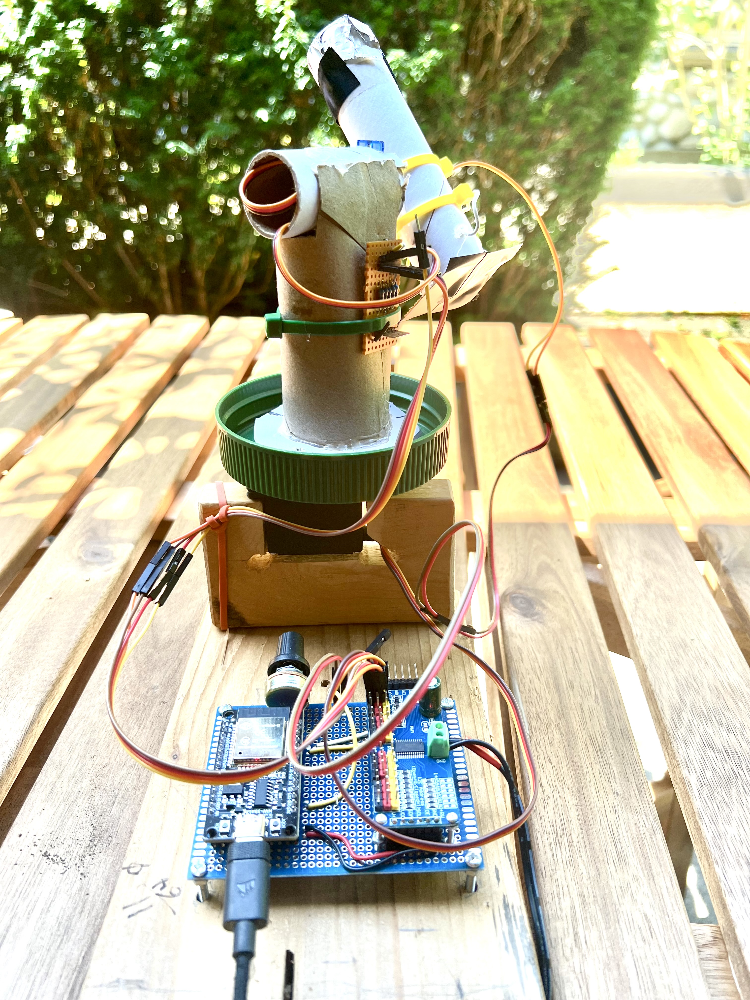
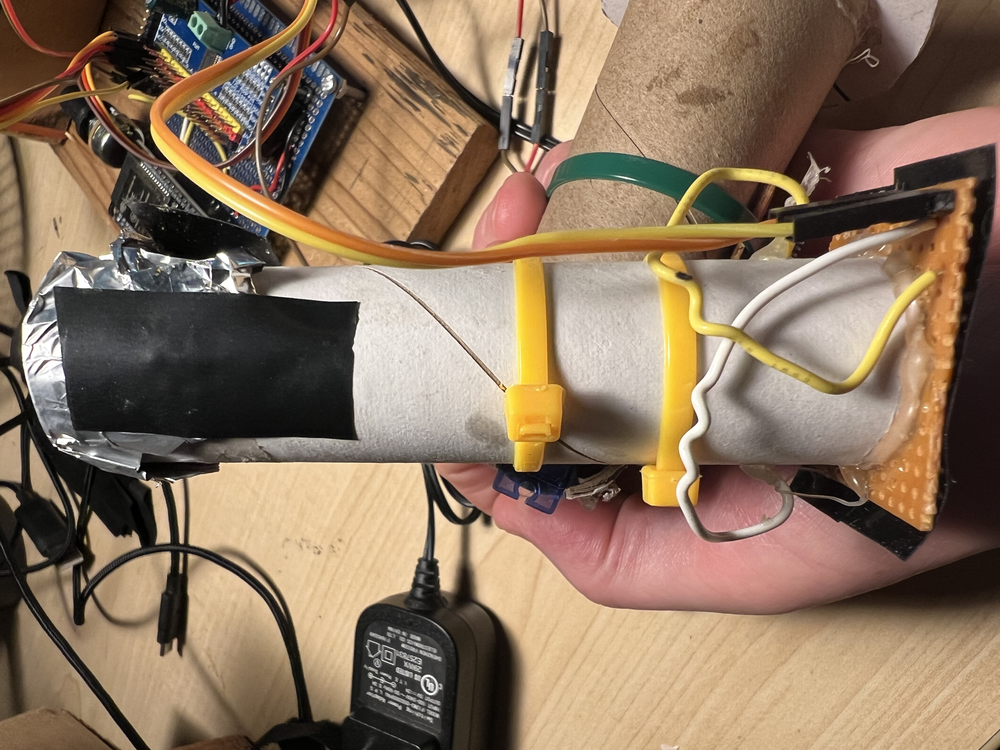
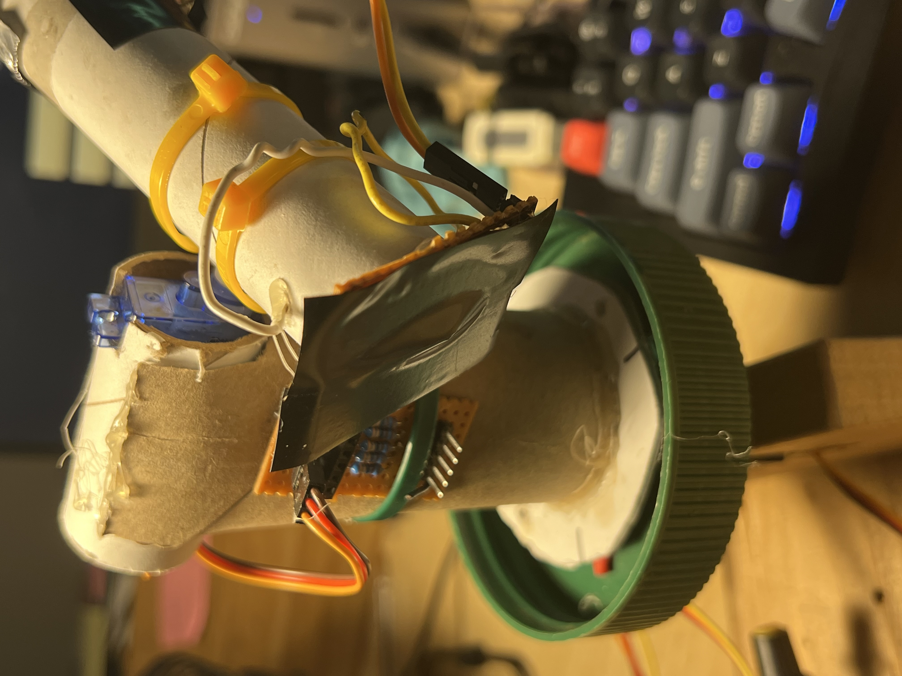
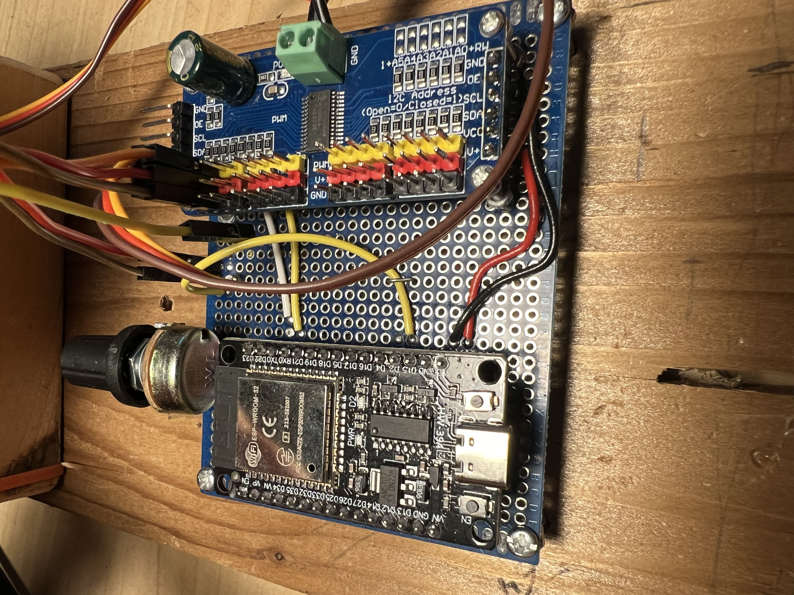

_Also written up at [Hackaday.com][9]._

This project came about when I came across [this project][0] ([Hackaday
writeup][1]), where the creator made a one-pixel camera out of an IR
sensor and an Arduino.  Because the sensor acted as a single pixel, he
mounted it on two servos and assembled a picture by scanning it in the
X-Y axis.

My version is a little different:

* I'm using a photoresistor instead of an IR photodiode.
* I'm using an ESP32.  Though I started out with an Arduino, I found
  it easier to switch to MicroPython.
* The original creator's stand was a lovely assembly of chromed metal.
  Mine is, uh, a little more primitive^Whomespun.

## But first...how does it look?

![Comparison][6]

On the left is a picture on a sunny day on my front porch; on the
right is a picture taken with my phone.  The scene is definitely
recognizable, but doesn't seem as detailed as the original creator got
with his.  It takes 7.5 minutes to take a 90 pixel by 90 pixel image.

## The Imager

The imager is a dirt-simple pinhole camera. Its sensor is a random
photoresistor.  I had missed the part of the original writeup where
the IR sensor was mentioned; I'm not sure if that's why I'm seeing the
difference in quality in my pictures, but it's clear that the original
pictures are much nicer than I've been able to achieve.

I've mounted it on a bit of prototype board; I covered the back with
electrical tape to shield the sensor from stray light.  I've hot-glued
a length of cardboard tube from some paper towels to the board, then
covered the end with aluminum foil.  I poked a hole about 2mm across.
Side note: having the pinhole, instead of leaving the end uncovered,
was an incredible improvement in image quality.  I knew pinhole
cameras were a thing, but the difference was truly shocking.

The resistor is fed with 3.3V from the ESP32, and I'm reading the drop
in voltage with one of the ESP32's analog sensors.  I'm doing this in
16-bit mode, which is overkill and useless.  The voltage varies enough
that I read 10 samples and average them in order to try and keep
things reasonably constant.  

## The platform

The platform is more cardboard, plus hot glue and zip ties.  I've done
some amateur astronomy, so what I had in mind was a simple alt-az
mount.  The tube is zip tied to the horn of an SG90 servo, which moves
in the Y direction -- the altitude part of an alt-az mount.  The SG90
turned out to be rather weak, but it had enough power to do this.

The S90 is mounted in a short length of the same cardboard tube used
for the sensor; it fit just right, so I didn't have to use any hot
glue there.  The azimuth mount is a cardboard tube from a roll of
toilet paper, and the altitude mount is hot-glued to the top.  This
tube also serves as the mount for the protoboard that connects the
photodiode and the altitude servo to the ESP32.  The protoboard was
scrap from another project, but it had some nice header pins already
in place and works well.  It's held in place with a zip tie.

The bottom is a disk of what I've learned is called [mat board][2]; I
picked a random waiting-to-be-reused gift box to do this with, and I'm
now in love with the stuff.  On the bottom of that are three pairs of
magnets, wrapped in different colours of shrinkwrap tubing and
hot-glued in place.  These mate with ones with matching colours on the
base (more on that in a sec); having an easy way to remove and replace
the camera is incredibly handy.

## The base

The base was made by my father-in-law out of scrap wood.  He's a
retired millwright who loves collaborating on these projects, and has
a garage and all the tools you need to rebuild civilization -- so he's
a great ally to have.  In the base's vertical component is a Tower
TG90 servo, which rotates in the Y axis -- the azimuth part of an
alt-az mount.  Originally I'd tried using an SG90 for this, but it
didn't have the strength to rotate the lid.  (Side note: I also got
confused when ordering the replacement servos...it turns out a "360
degree servo" is just a continuous rotation motor, not a servo that
can go to any angle between 0 and 360 degrees.  🤦)

Mounted to the azimuth servo is a plastic peanut butter jar lid, held
in place with a random thumbscrew from the junk drawer.  The magnets I
mentioned above glom on to the platform.

The base's horizontal component has mounting holes for the screws that
act as legs for the electronics board.  Speaking of which...  

## The electronics board

The electronics board is a small piece of prototype board.  I've put
in header pins for the ESP32, and drilled mounting holes for the PWM
controller.

The controller is a PCA9685; I'm only using two channels, but it's
very handy.  I've got a separate power supply for it, hanging off the
side.  (Side note: oh my god, if you're having any problems with
servos, swap out the power supply and try something else.  I had no
end of erratic behaviour until I got a new supply that could do 2 Amps
at 5 Volts.)

The photoresistor in the sensor is connected to the ESP32 through a 5K
potentiometer.  I was hoping that this would let me adjust the
sensitivity for dim or bright scenes, but it hasn't been as useful as
I'd hoped.

## The code

The code for this project [can be found here][3] ([Gitlab mirror][4]).

The ESP32 is my second-favourite platform after the Pi Pico, and
MicroPython is definitely my favourite language.  I can write C++ for
Arduino stuff, but mainly by copy-pasta.  I'm much more familiar with
Python, and it's an absolutely perfect fit for my brain.

The code on the microcontroller is pretty simple: there's a library
for the PCA9685, then some code I wrote to swing the servos around as
needed and take readings.  The altitude arm moves the imager from top
to bottom, stopping at one degree increments to take readings.  When
it reaches the bottom, the azimuth arm turns by one degree, then the
altitude servo swings the imager back up before scanning down again.
(Originally I had it scanning in both directions, but for some reason
the resulting image was quite jagged -- the match between adjacent
columns was quite terrible.) I'm sure the movement isn't exactly one
degree, and I can see at least some points where the azimuth servo
just doesn't seem to rotate at all, but so far it seems to be working
well enough.  The data is just printed to the serial port (ie, the USB
cable) connected to my laptop.

The laptop, meanwhile, is running the capture code and the image
processing code (such as it is); Pandas, numpy and Matplotlib are used
heavily.  The capture code reads the data from the serial port; when
the camera signals it's done, the data is written to file in CSV
format.  (Writing out actual image files is on the TODO list.) After
that, the image is displayed along with some semi-useful histograms.

It doesn't take much to max out the camera, so I [clamp the data to a
normal distribution][5] to try and bring out details that might otherwise
get lost; it's definitely an improvement, as you can see here:

![Original vs clamped][8]

(This is the same picture as is at the top of this article.)

In addition to clamping the data, I also use bicubic interpolation on
the pixels to smooth out the edges; that's what takes away the
pixellated look from the original.

The result of all this is a 90 x 90 pixel greyscale image with heavy
distortion, unexplainable streaks, and terrible dynamic range.  I love
it!

## Shortcomings, accusations and TODOs

* The dynamic range of the image is pretty low.  I'm guessing at least
  some of that is due to my code, but I think the photoresistor is
  also to blame.  I'm curious whether an IR sensor, as was used in the
  original project, would change things.
* I'm oddly proud of the construction.  It's not much, but this is a
  big improvement over the kind of things I've constructed in the
  past.
* The jumper wires definitely need to be replaced; connections to the
  servo are sometimes erratic and the result is a pretty distorted
  image.
* The original camera moved quite fast; I've elected to have the
  imager stop to take readings at each degree.  I wonder what a
  continuous rotation approach would look like.
* I'm sure there's much to be improved with the image processing and
  display.
* I'll say it again: if you ever have erratic behaviour from a servo,
  try changing the power supply.  I waited far too long before going
  out to Value Village and buying a dozen 5V power supplies of
  different ratings, and the first one I tried did away with all the
  halting, jerking, and random failures I had been encountering.

[0]: http://chynehome.com/web/index.php/2015/01/29/appareil-photo-de-1-pixel-avec-un-arduino/
[1]: https://hackaday.com/2015/01/31/a-single-pixel-digital-camera-with-arduino/
[2]: https://learn.adafruit.com/cardboard-fundamentals/cardboard-types
[3]: https://github.com/saintaardvark/arduino-one-pixel-camera
[4]: https://gitlab.com/saintaardvark/arduino-one-pixel-camera
[5]: https://stackoverflow.com/questions/23199796/detect-and-exclude-outliers-in-a-pandas-dataframe/69001342#69001342
[6]: one-pixel-camera-comparison.png
[7]: IMG_7629.jpeg
[8]: original-vs-clamped.png
[9]: https://hackaday.com/2024/07/23/photoresistor-based-single-pixel-camera/
